# tama-cc-devflow

タスクの重さに応じて流れを変えるマルチ Agent 開発フロー。依頼を Small / Large に振り分け、設計・実装・レビューを Sub Agent に回し、人間の判断が要る場所でだけ止まり、最後に PR を作る。

```
/plugin marketplace add tamashiro-syuta/tama-cc-kit
/plugin install tama-cc-devflow@tama-cc-kit

/tama-cc-devflow:run <依頼>      # 開始。GitHub / Notion / Slack のリンク可
/tama-cc-devflow:status         # phase、Wave ごとのタスク、判断待ち
/tama-cc-devflow:resume         # チェックポイントから続行
```

- [設計のポイント](#設計のポイント)
- [全体の流れ](#全体の流れ)
- [Large フロー](#large-フロー)
- [人間へのヒアリング](#人間へのヒアリングgrill-me-形式)
- [Small フロー](#small-フロー)
- [Wave と並列実装](#wave-と並列実装)
- [Agent とモデル](#agent-とモデル)
- [ホワイトボード](#ホワイトボード)
- [Write guard](#write-guard)
- [上限と停止条件](#上限と停止条件)
- [中断と再開](#中断と再開)
- [構成](#構成)

図の凡例: 緑の実線枠が Agent、橙の枠が人間の判断、灰色が入力 / 成果物。

## 設計のポイント

**仮定の強制列挙で振り分ける**
Router は「実装できるか」ではなく「実装者が誰にも聞かずに置くことになる仮定」を全部書き出す。影響度 high の仮定が 1 つでもあれば Large。迷ったら Large。

**状態はファイル、会話ではない**
Agent は会話履歴を受け取らない。`.tama-cc-devflow/<session>/` のホワイトボードから必要なファイルだけ読み、決められたファイルだけ書く。

**レビューは有限回、判断は人間**
Agent 同士のループは設計レビュー 3 回、タスクレビュー 3 回、Small は 1 回。人間への質問は grill-me 形式で 1 問ずつ推奨回答付きに聞き、こちらには上限を設けない。

**hook が編集範囲を物理的に守る**
PreToolUse hook が、実装中はタスクの `write_scope` 外への Edit / Write を、それ以外の phase ではソース編集をすべてブロックする。

## 全体の流れ

`run` Skill が Orchestrator になる。セッションを作り、依頼とリンク先を `context.md` に整理し、Router に判定させ、サイズに応じたフロー Skill に処理を渡す。

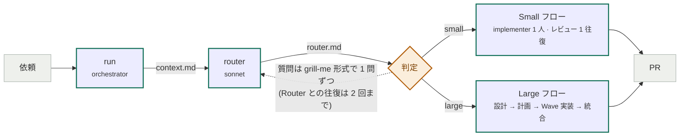

Router が書く `router.md` には一発 Large 条件、Small 条件の採点、仮定一覧、人間への質問、判定が入る。Small のときは Task draft も書く。small 判定は人間が large に上書きできる。

### Router の判定ルール

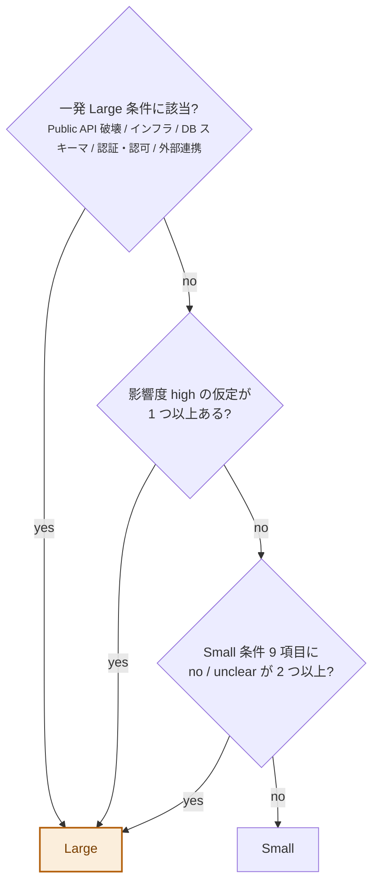

1. **一発 Large 条件**: Public API の破壊的変更、インフラ変更、DB スキーマ変更、認証 / 認可、外部サービス連携。1 つでも該当すれば Large。
2. **Small 条件**: 1〜3 ファイルに閉じる、既存パターンを踏襲できる、新しい設計判断がない、など 9 項目を yes / no / unclear で採点。
3. **仮定の強制列挙**: エッジケース、命名、配置場所、データ形状、エラー時の挙動、互換性、テストについて暗黙の仮定を列挙し、high / medium / low を付ける。
4. **判定**: 一発条件に該当、high の仮定が 1 つ以上、Small 条件に no / unclear が 2 つ以上、のいずれかで Large。

## Large フロー

設計を固めてから分解し、Wave 単位で並列実装する。各段階に有限回のレビューループがあり、設計承認と最終レビューの 2 か所で人間が止める。

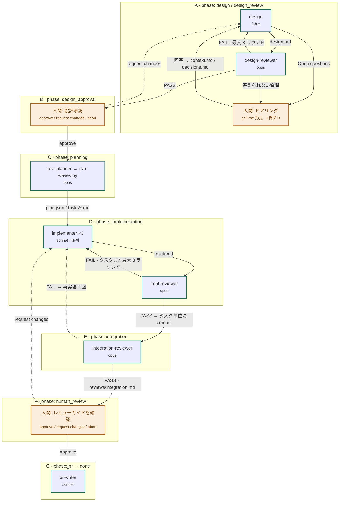

| 段階 | 内容 |
|---|---|
| A | 設計中の疑問とレビュアーの質問は、まず design が答え、残りを人間に 1 問ずつ聞いてから改訂。レビューは最大 3 ラウンド |
| B | 要約、インターフェース変更、異常系とロールバック、タスク分解案を提示。Open questions は A で解消済みが前提 |
| C | `plan.json` と `tasks/*.md`。write_scope 競合を検出して Wave を割り当て、`devflow/<slug>` ブランチを作る |
| D | Wave ごとに ready なタスクを最大 3 件並列。PASS でタスク単位に commit。design break は分類し、partial / full-redesign は止めて争点をヒアリングしてから人間が選ぶ |
| E | タスク横断の整合性、テスト / lint / 型チェック全体、要件カバレッジ、人間レビューガイドの作成 |
| F | must-read files、risk hotspots、運用 / 異常系の論点、推奨する手動検証を提示。全部は読ませない |
| G | push、`pr-body.md` 作成、`gh pr create`。設計決定と人間レビューガイドを PR 本文に転記。最終報告に PR URL、Wave とタスク、使ったレビューラウンド、人間が解決した block、残した non-blocking 指摘 |

### 設計書に必ず含めるもの

design Agent は設計を 1 つに決め、代替案は Rejected alternatives にだけ書く。Summary、Requirements mapping、Chosen design、Impact、Error handling policy、Rollback policy、Observability、Task breakdown proposal、Open questions が必須で、該当なしでも "none" と明記する。改訂時は冒頭に Changes since last round を置き、以前の内容を黙って落とさない。Open questions には人間の判断が必要なものだけを推奨回答付きで書き、コードを調べれば分かることは自分で確定する。返答は `summary` と `open_questions_for_human` の 2 行に固定される。

## 人間へのヒアリング(grill-me 形式)

人間の判断が要る疑問は、一覧で投げて「どうしますか」と聞かない。Agent 専用 Skill `clarify` が grill-me の手順で、決定ツリーの枝を 1 本ずつ潰す。

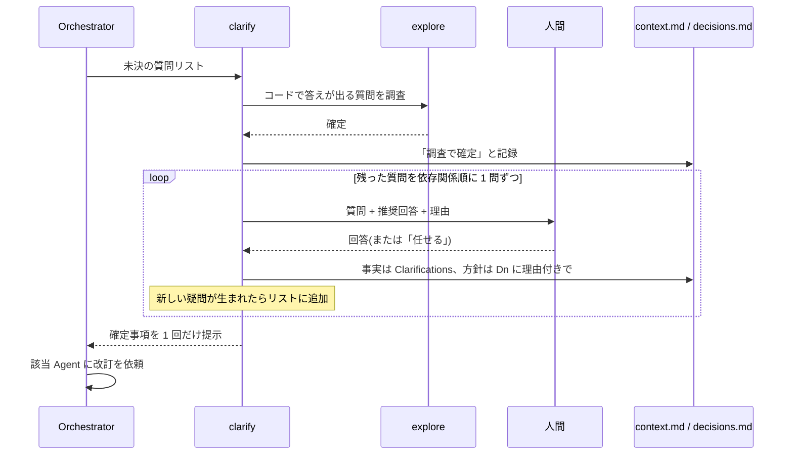

1. コードベースで答えが出る質問は人間に聞かない。`explore` で調べて確定し、「調査で確定」と明記して記録する。
2. 残った質問を依存関係順に並べ、**1 問ずつ**聞く。各質問に推奨回答と理由を付ける。選択肢が離散的なら AskUserQuestion で推奨案を先頭に置く。
3. 回答は即座に記録する。事実や仕様は `context.md` の Clarifications、方針を決める回答は `decisions.md` の `Dn` に理由付きで。回答が新しい疑問を生めばリストに足す。
4. 「任せる」なら推奨回答を採用し、委任した旨を残す。全枝が解消したら確定事項を 1 回だけ示して終わる。

| 呼び出し箇所 | 入力 | 解消後 |
|---|---|---|
| `run` Routing | `router.md` の Questions for human | 更新した context で Router を再実行(往復 2 回まで。残れば Large へ持ち越し) |
| `large-flow` A 設計中 | `design.md` の Open questions(`open_questions_for_human > 0`) | design が改訂。0 になるまで繰り返してからレビューへ |
| `large-flow` A 設計レビュー後 | reviewer の `human_decision_required: yes` のうち design が答えられなかったもの | design が改訂し再レビュー。この再レビューはラウンド上限に数えない |
| `large-flow` A 3 回 FAIL | 設計者とレビュアーの争点(推奨する落とし所付き) | `human-feedback.md` に書き、ラウンドを 0 に戻して改訂。解消しない時だけ受け入れ / 中止を選ぶ |
| `large-flow` D 実装 block | blocking が解消しない理由、崩れた前提 | 選択肢(手で直す / 指示を与えて再実行 / 再設計 / 中止)を提示 |

ヒアリング中に phase は変えない(Router 段階だけ `clarify`)。clarify 自身は設計や計画を書き換えず、記録だけして呼び出し元が該当 Agent に改訂を頼む。

## Small フロー

Router の Task draft をそのまま `tasks/T1.md` にし、implementer 1 人で実装する。再作業は 1 回だけ。

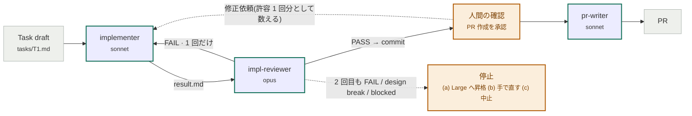

設計書は書かず、Router の draft を implementer が直接実装する。

## Wave と並列実装

task-planner が `plan.json` に `depends_on` と `write_scope` を明示し、`plan-waves.py` が検証して Wave を割り当てる。Wave は依存チェーンの長さ。実行時は `status.py ready` が最下位 Wave の pending タスクを最大 3 件ずつ払い出す。

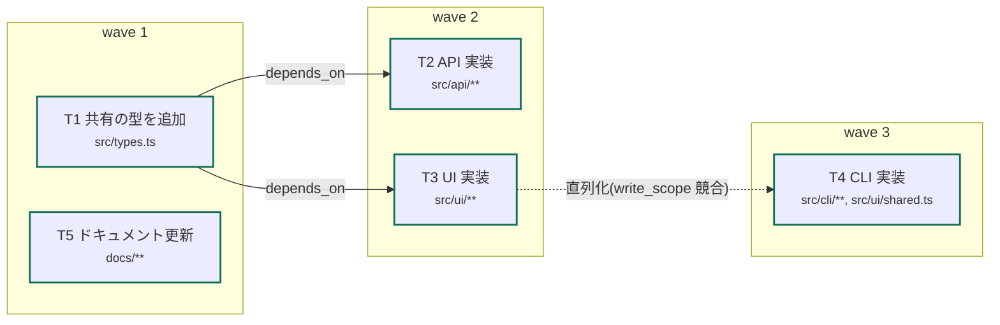

T4 は本来独立だが `src/ui/shared.ts` が T3 の write_scope と重なるため、`plan-waves.py` が T3 への依存を追加して Wave 3 に送る。同じ Wave で 1 つのファイルを複数タスクが触ることはない。`db_changes` / `infra_changes` を持つタスク同士も並列にしない。

- タスクは、自分のタスクファイルと `context.md`、`decisions.md` だけを読んだ implementer 1 人が一度で完了できる粒度にする。
- 共有のインターフェース・型・スキーマを変えるタスクは利用側より先に置く。マイグレーション、インフラ、共通ライブラリは独立タスクにする。
- 小さなタスクを多数作らない。テストは挙動を導入するタスクに含める。
- 直列化が起きたら Orchestrator は統合か scope の縮小を planner に差し戻す(最大 2 ラウンド)。

## Agent とモデル

各 Agent は書いてよいファイルが 1 つか 2 つに固定されていて、それ以外は読むだけ。モデルは役割の重さで使い分ける。fable は白紙から構造を作る `design` のみ。明文化された基準に照合するレビュー系は opus、調査・実装・定型作業は sonnet。

| Agent | 役割 | モデル | 書くファイル |
|---|---|---|---|
| `router` | Small / Large 分類。仮定の強制列挙 | sonnet | `router.md` |
| `explore` | 他 Agent 向けの読み取り専用コード調査 | sonnet | なし |
| `design` | 設計書と決定事項。却下案、影響範囲、異常系、ロールバック。Open questions は人間判断が必要なものだけ推奨回答付き | fable | `design/design.md`, `decisions.md` |
| `design-reviewer` | 合格条件 10 項目に対する PASS / FAIL 判定 | opus | `reviews/design-r<N>.md` |
| `task-planner` | タスク分解、依存関係、scope。`plan-waves.py` の実行 | opus | `plan.json`, `tasks/<id>.md` |
| `implementer` | タスク 1 件を write_scope 内で実装。コミットしない | sonnet | write_scope 内のソース, `tasks/<id>.result.md` |
| `impl-reviewer` | 受け入れ条件の検証、テスト実行、design break の分類 | opus | `reviews/<id>-r<N>.md` |
| `integration-reviewer` | 変更全体の整合性、チェック実行、人間レビューガイド | opus | `reviews/integration.md` |
| `pr-writer` | push と `gh pr create` | sonnet | `pr-body.md` |

Agent の返答は数行の固定フォーマット(例: `verdict: PASS|FAIL`、`blocking: <count>`)に限られる。Orchestrator はそれと `status.json` だけを見て次の遷移を決める。ファイルの内容はプロンプトに貼らず、Agent が自分で読む。

## ホワイトボード

すべての状態は `<project>/.tama-cc-devflow/<session-id>/` に置く(git 管理外。プロジェクトの `.gitignore` には触れず、global gitignore で `**/.tama-cc-devflow/` を無視する)。`.tama-cc-devflow/current` が最新セッションの id を指す。

```
SESSION_DIR/
  status.json                 phase、tasks、review_rounds。スクリプト経由でのみ更新
  context.md                  依頼原文、要件、制約、関連ファイル、人間への確認結果
  decisions.md                "## Dn: title" / "- Decision:" / "- Reason:" の決定だけ
  router.md                   判定、仮定一覧、Task draft(Small)
  design/design.md            設計書(Large)
  design/human-feedback.md    設計への人間の修正依頼(Large、任意)
  plan.json                   タスクのメタデータ(Large)
  plan-feedback.md            Orchestrator から task-planner への差し戻し(任意)
  tasks/<id>.md               タスク定義。Human feedback / Integration findings はここに追記
  tasks/<id>.result.md        implementer の結果
  reviews/design-r<N>.md      設計レビュー N ラウンド目
  reviews/<id>-r<N>.md        実装レビュー N ラウンド目
  reviews/integration.md      統合レビュー + 人間レビューガイド
  pr-body.md                  PR 本文
```

### 誰が何を読み書きするか

`context.md` と `decisions.md` はほぼ全 Agent が読むので図から省く。矢印は「読む → Agent → 書く」。

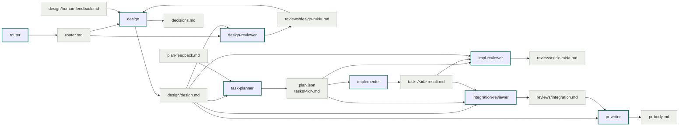

`status.json` は Orchestrator がスクリプト経由でだけ更新し、Agent は触らない。`human-feedback.md` と `plan-feedback.md` は Orchestrator が書く差し戻し。

### status.json とスクリプト

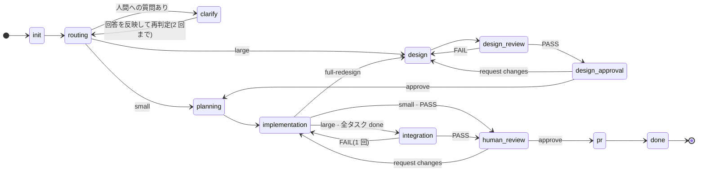

Small は `planning` で Task draft を `tasks/T1.md` に写すだけで、`design` 系と `integration` を通らない。`abort` はどの phase からも `aborted` に遷移できる(図では省略)。タスク状態は `pending / running / review / done / failed / blocked`。手で編集せず、必ずスクリプトを使う。

```
status.py summary                       # phase、Wave ごとのタスク、判断待ち
status.py set phase '"design"'          # 値は JSON。文字列は引用符が要る
status.py task T1 running               # review への遷移で review_rounds が +1
status.py ready                         # 今実行できるタスク id。最下位 Wave から最大 3 件
status.py reset-running                 # running / review を pending に戻す(resume 用)
plan-waves.py                           # plan.json 検証、write_scope 競合の直列化、Wave 割当
```

## Write guard

`hooks.json` の PreToolUse hook が Edit / Write / NotebookEdit のたびに `guard-write-scope.py` を実行する。`status.json` の `claude_session_id` が現在の Claude セッションと一致し、phase が guard 対象のときだけ働く。`.tama-cc-devflow/` への書き込みは常に通す。

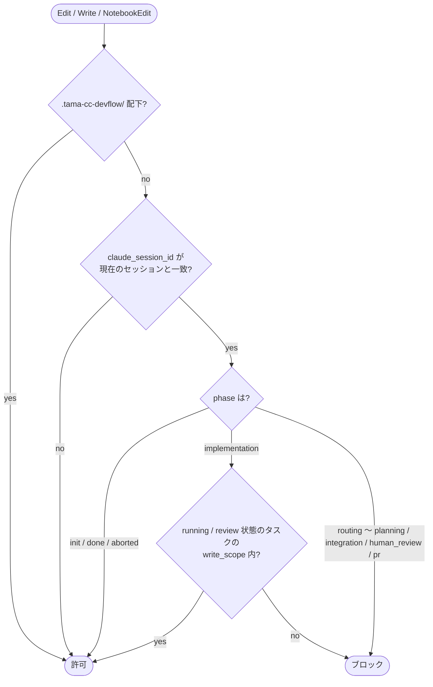

| phase | ソースファイルへの編集 |
|---|---|
| `implementation` | `running` / `review` 状態のタスクの `write_scope` 内のみ許可 |
| `routing` 〜 `planning`, `integration`, `human_review`, `pr` | すべてブロック。ホワイトボードだけ書ける |
| `init`, `done`, `aborted`、別セッション所有 | guard は働かない |

> implementer は scope 外のファイルが必要になっても回避しない。結果ファイルの Deviations に scope 逸脱として報告する。Orchestrator は implementer を呼ぶ前にタスクを `running` にしておかないと、編集がすべてブロックされる。

## 上限と停止条件

| 項目 | 上限 | 上限に達したら |
|---|---|---|
| Router とヒアリングの往復 | 2 回 | Large として扱い、未決の質問を設計フェーズのヒアリングに持ち越す |
| 人間へのヒアリング(clarify) | なし | 上限があるのは Agent 同士のループだけ。同じ論点の言い換え再質問はしない |
| 設計レビュー | 3 ラウンド(ヒアリング後の再レビューは数えない) | 争点を 1 問ずつヒアリングして改訂。解消しない時だけ「受け入れ / 中止」を選ぶ |
| task-planner の差し戻し | 2 ラウンド | plan を人間に提示して判断を仰ぐ |
| タスクごとの実装レビュー(Large) | 3 ラウンド | タスクを `blocked` にし、人間が「手で直す / 指示を与えて再実行 / 中止」を選ぶ |
| 実装レビュー(Small) | 1 回の再作業 | Large へ昇格 / 手で直す / 中止 |
| 統合レビューの再作業 | 1 回 | 人間にエスカレーション |
| 同時に動く implementer | 3 | 残りは次の `ready` で払い出す |

人間に尋ねる前に必ず状況を `decisions.md` か `abort.md` に記録する。人間に何かを尋ねたら、ターンを終えて待つ。ゲートは飛ばさない。

### design break の扱い

implementer が設計で固定された Public API、データモデル、モジュール責務、エラー契約の変更を必要とした場合、それを実行せず design break として報告する。impl-reviewer が分類し、Orchestrator が対応を変える。

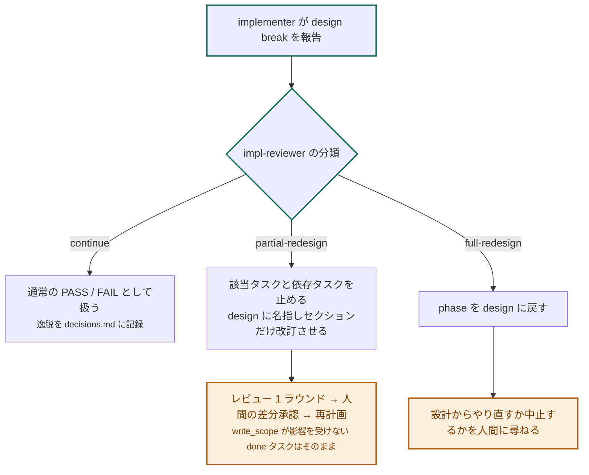

## 中断と再開

Orchestrator は各 Agent 呼び出しの前後で `status.json` を更新する。`/tama-cc-devflow:resume` はそれだけを頼りに続行できる。

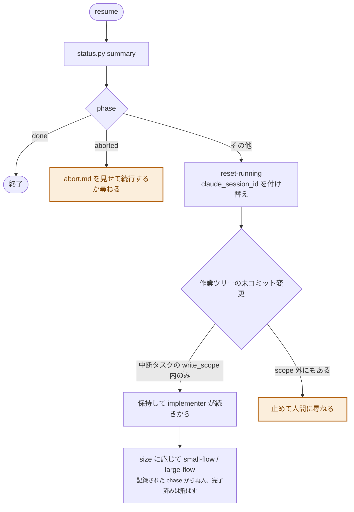

1. `status.py summary` で phase を確認する。`done` なら終了、`aborted` なら `abort.md` を見せて続行するか尋ねる。
2. `reset-running` で中断していたタスクを `pending` に戻し、`claude_session_id` を今のセッションに付け替える(write guard の所有者が変わる)。
3. 作業ツリーを確認する。中断タスクの write_scope 内の未コミット変更は保持し、implementer が続きから作業する。それ以外の未コミット変更があれば止めて人間に尋ねる。
4. `size` に応じて small-flow / large-flow を呼ぶ。両 Skill は再入可能で、記録された phase から続行し、完了済みの作業は飛ばす。

回復不能な失敗時は phase を `aborted` にして `abort.md` に経緯を書く。ブランチは調査用に残し、`git checkout <base_branch>` で戻れることを人間に伝える。

## 構成

```
plugins/tama-cc-devflow/
  skills/run, resume, status      ユーザーが起動する入口
  skills/workboard                ホワイトボードの Schema と規約(Agent 専用)
  skills/clarify                  grill-me 形式ヒアリング(1 問ずつ、推奨回答付き。Agent 専用)
  skills/small-flow, large-flow   オーケストレーション手順(Agent 専用、再入可能)
  agents/*.md                     Sub Agent 定義(model、tools、maxTurns、書いてよいファイル)
  hooks/hooks.json                PreToolUse の write_scope guard
  scripts/init-session.sh         セッションディレクトリの作成
  scripts/status.py               status.json の読み書き、実行可能タスクの列挙
  scripts/plan-waves.py           plan.json の検証、write_scope 競合の検出、Wave 割当
  scripts/guard-write-scope.py    PreToolUse hook 本体
```

必要なもの: `git`、認証済みの `gh`、`python3`。セットアップとして global gitignore(`core.excludesFile`)に `**/.tama-cc-devflow/` を追加する。プラグインはプロジェクトの `.gitignore` に触れない。ローカル開発は `claude --plugin-dir ./plugins/tama-cc-devflow` と `claude plugin validate ./plugins/tama-cc-devflow --strict`。
